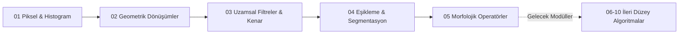

# Dijital Görüntü İşleme ve Bilgisayarlı Görü Yol Haritası


Bu repository; sıfırdan bilgisayarlı görü (computer vision) ve dijital görüntü işleme (DIP) alanına adım atmak isteyen mühendisler, araştırmacılar ve öğrenciler için hazırlanmış kapsamlı bir **eğitim şablonu ve uygulama yol haritasıdır**. Temel piksel matrislerinden uzamsal konvolüsyon filtrelerine, geometrik dönüşümlerden morfolojik operatörlere kadar olan çekirdek algoritmaları hem matematiksel arka planı hem de pratik Jupyter notebook uygulamalarıyla sunar.

---

## Müfredat Akış Şeması



---

## Müfredat ve Modül Haritası

| No | Modül Adı | Temel Algoritma / Yöntem | Matematiksel Odak | Durum | Dizin |
|:---|:---|:---|:---|:---|:---|
| **01** | Temel Piksel ve Histogram | Histogram Eşitleme, CLAHE | Kümülatif Dağılım Fonksiyonu (CDF), Yerel Kontrast | Tamamlandı | `01-temel-piksel-ve-histogram-islemleri/` |
| **02** | Geometrik Dönüşümler | Afin Dönüşümü, Bilinear Interpolation | 3x3 Homojen Dönüşüm Matrisi, 4-Komşu Enterpolasyon | Tamamlandı | `02-geometrik-donusumler-ve-enterpolasyon/` |
| **03** | Uzamsal Filtreleme | Sobel Kenar Tespiti | 2B Ayrık Konvolüsyon, Gradyan Büyüklüğü ve Açısı | Tamamlandı | `03-uzamsal-filtreleme-ve-kenar-belirleme/` |
| **04** | Eşikleme ve İkili Görüntü | Dinamik / Uyarlamalı Eşikleme | Yerel Ortalama ve Gauss Pencereleme, Eşikleme | Tamamlandı | `04-esikleme-ve-ikili-goruntu-islemleri/` |
| **05** | Morfolojik Operatörler | Genişletme, Aşındırma, Açma, Kapama | Yapılandırıcı Eleman, Minkowski Küme İşlemleri | Tamamlandı | `05-morfolojik-goruntu-islemleri/` |
| **06** | Canny Kenar Algılama | Non-Maximum Suppression, Histerezis | Çift Eşikli Kenar İzleme | Yol Haritasında | `06-canny-kenar-tespiti-ve-gradyan-yonu/` |
| **07** | Kontur Analizi | `findContours`, Geometrik Momentler | Yeşil Alan, Çevre, Sınırlayıcı Dikdörtgen | Yol Haritasında | `07-kontur-analizi-ve-geometrik-olcum/` |
| **08** | Hough Dönüşümü | Hough Çizgi ve Çember Tespiti | Parametre Uzayı Akümülatörü, Polar Koordinatlar | Yol Haritasında | `08-hough-donusumu-cizgi-ve-daire-tespiti/` |
| **09** | Renk Uzayları | RGB, HSV, LAB ve Renk Maskeleme | Renk Özü (Hue), Doygunluk (Saturation), Parlaklık | Yol Haritasında | `09-renk-uzaylari-ve-segmentasyon/` |
| **10** | Haar Cascade Sınıflandırma | AdaBoost Zayıf Öğreniciler, İntegral Görüntü | Haar Benzeri Öznitelikler ile Yüz Algılama | Yol Haritasında | `10-haar-cascade-ile-yuz-ve-goz-tespiti/` |

---

## 1. Temel Piksel ve Histogram İşlemleri (`01-temel-piksel-ve-histogram-islemleri`)

Piksel değerlerinin histogram dağılımı üzerinden kontrast analizi ve dinamik aralık iyileştirmesi:
- **Histogram Eşitleme:** Görüntüdeki gri seviye dağılımını tüm dinamik aralığa yaymak için kümülatif olasılık dağılım fonksiyonu (CDF) kullanılır:
  $$s_k = T(r_k) = (L-1) \sum_{j=0}^k p_r(r_j) = \frac{L-1}{MN} \sum_{j=0}^k n_j$$
- **CLAHE (Contrast Limited Adaptive Histogram Equalization):** Global eşitlemenin neden olduğu aşırı parlama ve gürültü amplifikasyonunu önlemek amacıyla görüntüyü yerel alt ızgaralara (tiles) böler ve kontrastı bir kırpma limiti (clip limit) ile sınırlar.

---

## 2. Geometrik Dönüşümler ve Enterpolasyon (`02-geometrik-donusumler-ve-enterpolasyon`)

Görüntü koordinat uzayının matris manipülasyonları:
- **Afin Dönüşüm Matrisi:** Doğruların paralelliğini koruyan doğrusal koordinat dönüşümü:
  $$\begin{bmatrix} x' \\ y' \\ 1 \end{bmatrix} = \begin{bmatrix} a & b & t_x \\ c & d & t_y \\ 0 & 0 & 1 \end{bmatrix} \begin{bmatrix} x \\ y \\ 1 \end{bmatrix}$$
- **Çift Doğrusal Enterpolasyon (Bilinear Interpolation):** Dönüşüm sonrası tamsayı olmayan koordinatlardaki piksel değerini belirlemek için en yakın 4 komşu pikselin ağırlıklı ortalaması alınır:
  $$f(x,y) \approx \frac{(x_2-x)(y_2-y)}{(x_2-x_1)(y_2-y_1)}f(Q_{11}) + \frac{(x-x_1)(y_2-y)}{(x_2-x_1)(y_2-y_1)}f(Q_{21}) + \frac{(x_2-x)(y-y_1)}{(x_2-x_1)(y_2-y_1)}f(Q_{12}) + \frac{(x-x_1)(y-y_1)}{(x_2-x_1)(y_2-y_1)}f(Q_{22})$$

---

## 3. Uzamsal Filtreleme ve Sobel Kenar Tespiti (`03-uzamsal-filtreleme-ve-kenar-belirleme`)

Piksel yoğunluğundaki ani değişimlerin (gradyanların) birinci türev çekirdekleri ile çıkarımı:
- **Sobel Konvolüsyon Çekirdekleri:**
  $$G_x = \begin{bmatrix} -1 & 0 & +1 \\ -2 & 0 & +2 \\ -1 & 0 & +1 \end{bmatrix} * I, \quad G_y = \begin{bmatrix} -1 & -2 & -1 \\ 0 & 0 & 0 \\ +1 & +2 & +1 \end{bmatrix} * I$$
- **Toplam Kenar Gradyanı ve Yönü:**
  $$G = \sqrt{G_x^2 + G_y^2}, \quad \theta = \arctan\left(\frac{G_y}{G_x}\right)$$

---

## 4. Dinamik ve Uyarlamalı Eşikleme (`04-esikleme-ve-ikili-goruntu-islemleri`)

Düzensiz aydınlatma koşullarında sabit küresel eşik yerine, her pikselin etrafındaki yerel $N \times N$ komşuluk penceresinin ortalaması veya Gauss ağırlıklı ortalaması hesaplanarak dinamik eşik değeri belirlenir:
$$T(x,y) = \text{mean}_{k \in N(x,y)} I(k) - C$$

---

## 5. Morfolojik Operatörler (`05-morfolojik-goruntu-islemleri`)

İkili (binary) görüntüler üzerinde bir yapılandırıcı eleman (kernel) $B$ ile uygulanan küme teorisi işlemleri:
- **Aşındırma (Erosion):** $A \ominus B = \{ z \mid (B)_z \subseteq A \}$ (Nesne sınırlarını daraltır, küçük parazitleri yok eder)
- **Genişletme (Dilation):** $A \oplus B = \{ z \mid (\hat{B})_z \cap A \neq \emptyset \}$ (Delikleri kapatır, nesne sınırlarını genişletir)
- **Açma (Opening):** $(A \ominus B) \oplus B$ (Dış gürültüyü temizler)
- **Kapama (Closing):** $(A \oplus B) \ominus B$ (İç boşlukları ve çatlakları onarır)

---

## Gelecek Yol Haritası ve Eksikler (Gap Analysis)

Bu yol haritasının ikinci aşamasında sırayla kodlanacak ve entegre edilecek modüller:
- [ ] **Modül 06:** Canny Kenar Algılama ve Çift Eşikli Histerezis
- [ ] **Modül 07:** Kontur Çıkarımı, Nesne Sınırları ve Geometrik Şekil Sınıflandırma
- [ ] **Modül 08:** Hough Çizgi ve Çember Dönüşümleri ile Şerit / Daire Tespiti
- [ ] **Modül 09:** HSV / LAB Renk Uzaylarında Renk Filtreleme ve Segmentasyon
- [ ] **Modül 10:** Haar Cascade Sınıflandırıcılar ile Gerçek Zamanlı Yüz ve Göz Algılama

---

## Kurulum ve Çalıştırma

Projeyi yerel ortamınızda çalıştırmak için:

```bash
git clone https://github.com/SuleymanToklu/image-processing.git
cd image-processing

python3 -m venv venv
source venv/bin/activate
pip install opencv-python numpy matplotlib pillow jupyter

jupyter notebook
```